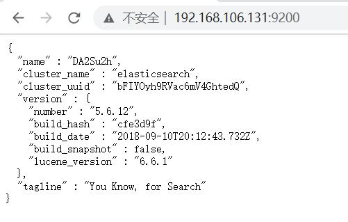

# ElasticSearch


## Dcoker下ElasticSearch的安装

```bash
# 拉取ElasticSearch镜像
docker pull docker.io/elasticsearch

# 运行镜像文件并创建容器
	# -e ES_JAVA_OPTS="-Xms256m -Xmx256m" 因电脑原因可设置内存最小与最大情况
docker run -e ES_JAVA_OPTS="-Xms256m -Xmx256m" -d -p 9200:9200 -p 9300:9300 --name ES01 5acf0e8da90b
```

访问 `虚拟机IP地址:9200`



