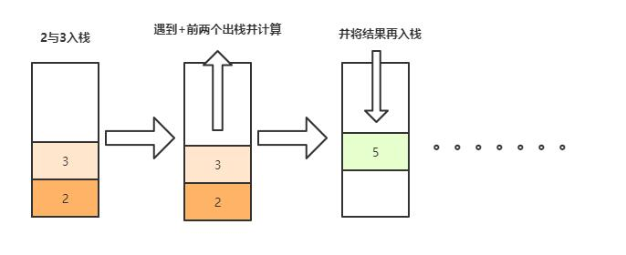

# 150. 逆波兰表达式求值

[题目链接](https://leetcode-cn.com/problems/evaluate-reverse-polish-notation/)

## 题目要求

根据 逆波兰表示法，求表达式的值。

有效的运算符包括 +, -, *, / 。每个运算对象可以是整数，也可以是另一个逆波兰表达式。

 

**说明：**

- 整数除法只保留整数部分。
- 给定逆波兰表达式总是有效的。换句话说，表达式总会得出有效数值且不存在除数为 0 的情况。

**示例 1：**

````txt
输入: ["2", "1", "+", "3", "*"]
输出: 9
解释: 该算式转化为常见的中缀算术表达式为：((2 + 1) * 3) = 9
````

**示例 2：**

````txt
输入: ["4", "13", "5", "/", "+"]
输出: 6
解释: 该算式转化为常见的中缀算术表达式为：(4 + (13 / 5)) = 6
````

**示例 3：**

````txt
输入: ["10", "6", "9", "3", "+", "-11", "*", "/", "*", "17", "+", "5", "+"]
输出: 22
解释: 
该算式转化为常见的中缀算术表达式为：
  ((10 * (6 / ((9 + 3) * -11))) + 17) + 5
= ((10 * (6 / (12 * -11))) + 17) + 5
= ((10 * (6 / -132)) + 17) + 5
= ((10 * 0) + 17) + 5
= (0 + 17) + 5
= 17 + 5
= 22
````

**逆波兰表达式：**

逆波兰表达式是一种后缀表达式，所谓后缀就是指算符写在后面。

- 平常使用的算式则是一种中缀表达式，如 ( 1 + 2 ) * ( 3 + 4 ) 。
- 该算式的逆波兰表达式写法为 ( ( 1 2 + ) ( 3 4 + ) * ) 。

逆波兰表达式主要有以下两个优点：

- 去掉括号后表达式无歧义，上式即便写成 1 2 + 3 4 + * 也可以依据次序计算出正确结果。
- 适合用栈操作运算：遇到数字则入栈；遇到算符则取出栈顶两个数字进行计算，并将结果压入栈中。

## 解题思路

### 方法1：栈

通过栈先进后出的思想，将数字一个个压入栈中，当遇到运算符之后将压入栈中的前两个数进行出栈与计算，并在压入栈中，最后栈中的数就是结果。



#### 代码

````java
public int evalRPN(String[] tokens) {
    int num1,num2;
    Stack<Integer> stack = new Stack<>();
    for (String token : tokens) {
        switch (token) {
            case "+":
                num1 = stack.pop();
                num2 = stack.pop();
                stack.push(num2 + num1);
                break;
            case "-":
                num1 = stack.pop();
                num2 = stack.pop();
                stack.push(num2 - num1);
                break;
            case "*":
                num1 = stack.pop();
                num2 = stack.pop();
                stack.push(num2 * num1);
                break;
            case "/":
                num1 = stack.pop();
                num2 = stack.pop();
                stack.push(num2 / num1);
                break;
            default:
                stack.push(Integer.valueOf(token));
        }
    }
    return stack.pop();
}
````

### 方法2：数组

