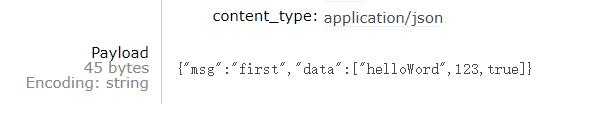

# Spring Boot集成RabbitMQ

如不了解 Rabbit MQ 请先查看本博客[RabbitMQ的基本使用](http://www.yifelix.cn/blog/104)

## 使用前配置

**添加依赖：**

```xml
<dependency>
    <groupId>org.springframework.boot</groupId>
    <artifactId>spring-boot-starter-amqp</artifactId>
</dependency>
```

配置文件

```yaml
spring:
  rabbitmq:
    host: 192.168.106.131		# 主机地址
    port: 5672					#端口号
    virtual-host: /ems			# 虚拟主机
    username: ems				#用户名
    password: 123456			#密码
```


## 使用 RabbitMQ

`RabbitTemplate` 消息模板，这是 Spring 整合 RabbitMQ 提供的消息模板，是进行发送消息的关键类。可以进行消息队列操作，可以在项目中直接注入即可使用。

### 一、Hello

#### 1.生产者

```java
@Autowired
private RabbitTemplate rabbitTemplate;

@Test
public void testHelloWorld(){
    rabbitTemplate.convertAndSend("hello","hello world");
}
```

#### 2.消费者

``@RabbitListener`` 注解指定目标方法作为消费者消费的类,可标注在类上，也可标注在方法上，当标注在类上需配合 ``@RabbitHandler`` ，具体使用哪个方法来处理。

```java
@Component             //默认持久化     非独占     不自动删除队列
@RabbitListener(queuesToDeclare = @Queue(value = "hello",durable = "false",autoDelete = "true"))
public class HelloConsumer {

    @RabbitHandler
    public void receive(String message){
        System.out.println("message=" + message);
    }
}
```


### 二、Work queues

在 `Spring AMQP` 中 `Work` 这种是公平调度，如果需要实现能者多劳需进行额外配置

#### 1.生产者

```java
@Test
public void testWork(){
    rabbitTemplate.convertAndSend("work","work模型1");
    rabbitTemplate.convertAndSend("work","work模型2");
}
```

#### 2.消费者

创建两消费者，它们会进行**轮询**消费消息

```java
//消费者1
@RabbitListener(queuesToDeclare = @Queue("work"))
public void receive1(String message){
    System.out.println("message1:" + message);
}

//消费者2
@RabbitListener(queuesToDeclare = @Queue("work"))
public void receive2(String message){
    System.out.println("message2:" + message);
}
```

### 三、Publish/Subscribe(发布订阅 fanout)

#### 1.生产者

```java
//fanout 广播模式
@Test
public void testFanout(){
    for (int i = 0; i < 10; i++) {
        rabbitTemplate.convertAndSend("logs","","Fanout" + i);
    }
}
```

#### 2.消费者

```java
//消费者1
@RabbitListener(queuesToDeclare = @Queue("work"))
public void receive1(String message){
    System.out.println("message1:" + message);
}

//消费者2
@RabbitListener(queuesToDeclare = @Queue("work"))
public void receive2(String message){
    System.out.println("message2:" + message);
}
```

### 四、Routing（路由）

#### 1.生产者

```java
//Routing 路由模式
@Test
public void testRouting(){
    rabbitTemplate.convertAndSend("directs","orange","orange信息");
    rabbitTemplate.convertAndSend("directs","black","black信息");
    rabbitTemplate.convertAndSend("directs","green","green信息");

}
```

#### 2.消费者

```java
@RabbitListener(bindings = {@QueueBinding(value = @Queue,   //创建临时队列
        exchange = @Exchange(value = "directs",type = "direct"), //指定交换机名与类型
        key = {"orange"}
)})
public void receive1(String message){
    System.out.println("消费者1：" + message);
}

@RabbitListener(bindings = {@QueueBinding(value = @Queue,   //创建临时队列
        exchange = @Exchange(value = "directs",type = "direct"), //指定交换机名与类型
        key = {"black","green"}
)})
public void receive2(String message){
    System.out.println("消费者2：" + message);
}
```

### 五、Topics（主题模式）

#### 1.生产者

```java
//topic 动态路由 订阅模式
@Test
public void testTopics(){
    rabbitTemplate.convertAndSend("topics","user.save","user.save信息");
    rabbitTemplate.convertAndSend("topics","order.add","order.add信息");
    rabbitTemplate.convertAndSend("topics","consumer.select.name","consumer.select.name信息");
}
```


#### 2.消费者

```java
@RabbitListener(bindings = {
        @QueueBinding(value = @Queue,
                exchange = @Exchange(name = "topics", type = "topic"),
                key = {"user.save", "user.*"})	//匹配规则
})
public void receive1(String message) {
    System.out.println("消费者1："+ message);
}

@RabbitListener(bindings = {
        @QueueBinding(value = @Queue,
                exchange = @Exchange(name = "topics", type = "topic"),
                key = {"order.*", "consumer.#"})	//匹配规则
})
public void receive2(String message) {
    System.out.println("消费者2："+ message);
}
```

## RabbitMQ 序列化转 Json

在 `RabbitTemplate` 类中可以找到 `MessageConverter`消息转换器，它的默认实现类为 `SimpleMessageConverter` 其中默认序列化为 jdk 自带序列化，现在想转换为Json的序列化器，找到 `MessageConverter` 中实现类


可自己创建配置类，进行 Json 序列化

**配置类：**

```java
/**
 * MQ配置类
 */
@Configuration
public class MyAMQPConfig {

    /**
     * 实现消息转换为Json
     * @return
     */
    @Bean
    public MessageConverter messageConverter(){
        return new Jackson2JsonMessageConverter();
    }

}
```

运行效果：



## AmqpAdmin管理组件的使用

当我们有些消息队列和交换机没有创建，那么可以使用 `AmqpAdmin` 来进行创建 `Exchange`、`Queue`、`Binding`等。

```java
public void create(){
    //创建一个Exchange
	amqpAdmin.declareExchange(new DirectExchange("amqpadmin.exchange"));
	//创建一个Queue
    amqpAdmin.declareQueue(new Queue("amqpadmin.queue",true));
    //创建绑定规则，让Exchange与Queue进行绑定
    amqpAdmin.declareBinding(new Binding("amqpadmin.queue",Binding.DestinationType.QUEUE,"amqpadmin.exchange",
            "amqp.key",null));
}
```

