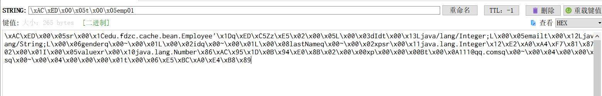
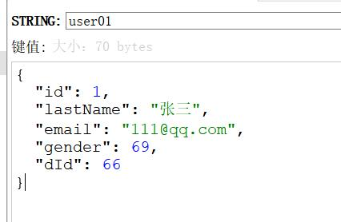

# SpringBoot集成Redis

## 使用前配置

我使用的是Docker来进行进行安装redis，并进行使用的，所以需先进行Docker中Redis的安装

**第一种方式**

````shell
#拉取redis镜像，如果速度很慢，请切换镜像仓库到淘宝，网易等国内镜像仓库
[root@centos-7 /] docker pull redis

# 查看所有镜像
[root@centos-7 /] docker images

# 安装完毕后，可以看到安装的所有镜像，能找到redis镜像
REPOSITORY          TAG                 IMAGE ID            CREATED             SIZE
docker.io/redis     latest              84c5f6e03bf0        19 hours ago        104 MB

# 启动redis镜像,
#	-d后台启动
#	-p映射端口，将虚拟机端口映射到容器端口
#	-name 容器名
docker run -d -p 6379:6379 --name myredis docker.io/redis

# 查看运行的容器

docker ps
#查看全部的docker容器，包括关闭的额
docker ps -a
````

**第二种方式：**

````shell
# 使用redis-cli登录，使用 whereis redis-cli 找到redis客户端
whereis redis-cli
# 登录客户端
redis cli
# 获取密码
config get requirepass
# 当没有密码时设置密码,12345改为自己需要设置的密码
config set requirepass 123456
# 当有密码的时候登录时需要密码登录
auth 123456
# 取消密码
config set requirepass ''
````

## 使用Redis

### 添加依赖：

#### <span style="color:red">Lettuce:</span>

```xml
<!-- Redis -->
<dependency>
    <groupId>org.springframework.boot</groupId>
    <artifactId>spring-boot-starter-data-redis</artifactId>
</dependency>

<!-- 集成redis连接池所需common-pool2，缺少了会报错 -->
<dependency>
    <groupId>org.apache.commons</groupId>
    <artifactId>commons-pool2</artifactId>
    <version>2.6.1</version>
</dependency>
```


点进``spring-boot-starter-data-redis``可以看到在Spring Boot 2.x之后将``Jedis``替换成了``Lettuce``


导入依赖之后先进行一些redis配置：

```properties
# Redis主机
spring.redis.host=192.168.106.129
# Redis密码
spring.redis.password=123456
# Redis端口号
spring.redis.port=6379
# 连接超时时间(毫秒)
spring.redis.timeout=1000
# 连接池中的最大空闲连接
spring.redis.lettuce.pool.max-idle=8
# 连接池最大阻塞等待时间（使用负值表示没有限制）
spring.redis.lettuce.pool.max-wait=-1
# 连接池中的最小空闲连接
spring.redis.lettuce.pool.min-idle=0
# 连接池最大连接数（使用负值表示没有限制）
spring.redis.lettuce.pool.max-active=8
```

#### <span style="color:red">jedis:</span>

```xml
<!--Redis-->
<dependency>
    <groupId>org.springframework.boot</groupId>
    <artifactId>spring-boot-starter-data-redis</artifactId>
    <!-- 必须要把lettuce移除掉，不让就算在application.yml中配置为jedis，也没效果 -->
    <exclusions>
        <exclusion>
            <artifactId>lettuce-core</artifactId>
            <groupId>io.lettuce</groupId>
        </exclusion>
    </exclusions>
</dependency>

<!--jedis-redis java 客户端-->
<dependency>
    <groupId>redis.clients</groupId>
    <artifactId>jedis</artifactId>
</dependency>

<!-- 集成redis连接池所需common-pool2，缺少了会报错 -->
<dependency>
    <groupId>org.apache.commons</groupId>
    <artifactId>commons-pool2</artifactId>
</dependency>
```


### 基本使用

```java
//String(字符串)、List(列表)、Set(集合)、Hash(散列)、ZSet（有序集合）
stringRedisTemplate.opsForValue()	//[String (字符串)]
stringRedisTemplate.opsForList()	//[List (列表)]
stringRedisTemplate.opsForSet()		//[Set（集合）]
stringRedisTemplate.opsForHash()	//[Hash(散列)]
stringRedisTemplate.opsForZSet()	//[ZSet（有序集合）]
```


## Redis对象序列化


从上图可以开出，在使用 Redis 保存<span style="color:red">对象</span>时，正常情况下 Spring Boot 使用的是 ``defaultSerializer`` 其使用的是 Jdk 自带序列化，并需要将实体类实现序列化接口，而保存在Redis中的数据也是使用序列化保存16进制数据



而有时候我们想使用 **json** 的数据来进行保存，那么就需要进行手动配置，我们查看 ``RedisAutoConfiguration``

```java
@Configuration(proxyBeanMethods = false)
@ConditionalOnClass(RedisOperations.class)
@EnableConfigurationProperties(RedisProperties.class)
@Import({ LettuceConnectionConfiguration.class, JedisConnectionConfiguration.class })
public class RedisAutoConfiguration {

	@Bean
	@ConditionalOnMissingBean(name = "redisTemplate")
	public RedisTemplate<Object, Object> redisTemplate(RedisConnectionFactory redisConnectionFactory)
			throws UnknownHostException {
		RedisTemplate<Object, Object> template = new RedisTemplate<>();
		template.setConnectionFactory(redisConnectionFactory);
		return template;
	}

	@Bean
	@ConditionalOnMissingBean
	public StringRedisTemplate stringRedisTemplate(RedisConnectionFactory redisConnectionFactory)
			throws UnknownHostException {
		StringRedisTemplate template = new StringRedisTemplate();
		template.setConnectionFactory(redisConnectionFactory);
		return template;
	}

}
```

从上文可以看出在一开始加载时，Redis 类会将 RedisTemplate 与 StringRedisTemplate 添加到 IOC 容器中，那么我们就对 RedisTemplate 进行重写，自定义一个 RedisTemplate

```java
@Configuration
public class MyRedisConfig {

    @Bean
    public RedisTemplate<Object, Employee> userRedisTemplate(RedisConnectionFactory redisConnectionFactory)
            throws UnknownHostException {
        RedisTemplate<Object, Employee> template = new RedisTemplate<>();
        template.setConnectionFactory(redisConnectionFactory);
        //使用Jackson序列化器
        Jackson2JsonRedisSerializer<Employee> serializer = new Jackson2JsonRedisSerializer<>(Employee.class);
        template.setDefaultSerializer(serializer);
        return template;
    }

}
```

从上图可以看出我只对自定义配置类添加了我自己需要 Jackson2JsonRedisSerializer 。现在对数据进行添加在查看可以看出数据已经转换为 JSON 格式




## Redis自定义缓存管理器

````java
/**
 * 配置Redis缓存管理器
 *
 * @param redisConnectionFactory
 * @return
 */
@Bean
public RedisCacheManager empCacheManager(RedisConnectionFactory redisConnectionFactory) {
    //redis默认缓存配置
    RedisCacheConfiguration config = RedisCacheConfiguration.defaultCacheConfig()
            //设置key的序列化方式
            .entryTtl(Duration.ofSeconds(600000))
            //设置key的序列化方式
 .serializeKeysWith(RedisSerializationContext.SerializationPair.fromSerializer(keySerializer()))
            //设置value的序列化方式
            .serializeValuesWith(RedisSerializationContext.SerializationPair.fromSerializer(valueSerializer()))
            // 不缓存null值
            .disableCachingNullValues();

    //根据redis缓存配置和redis连接工厂生成redis缓存管理器
    RedisCacheManager redisCacheManager = RedisCacheManager.builder(redisConnectionFactory).cacheDefaults(config).transactionAware().build(); 
    return redisCacheManager;
}
````


