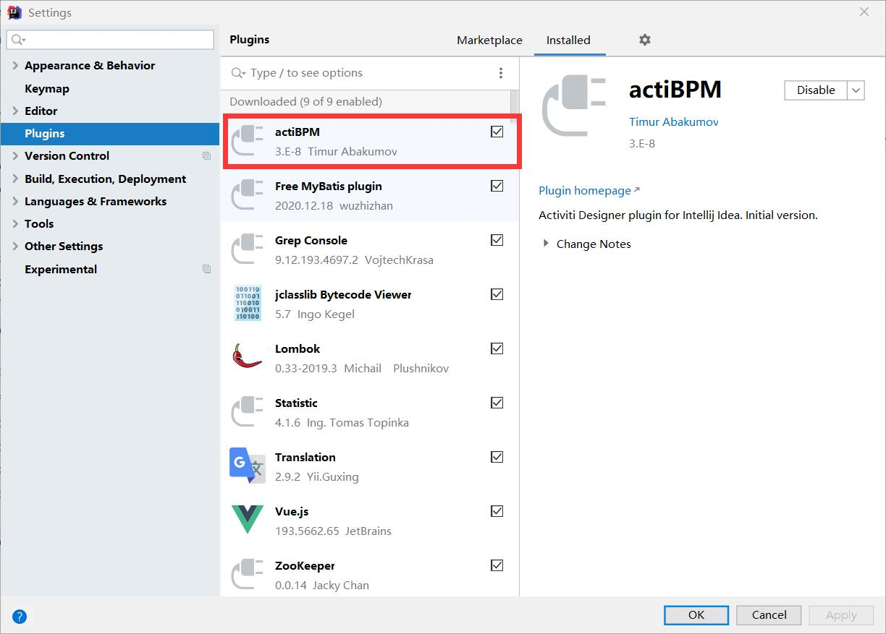
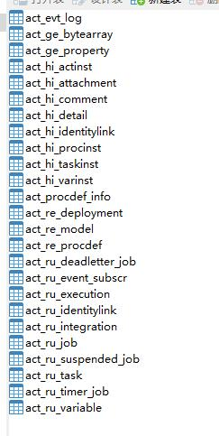

Activiti启


## 环境配置

### 开发环境

- JDK8
- MYSQL5.7
- Tomcat9
- IDEA


### Activiti环境

Activiti7，默认支持 Spring5


### Activiti 支持数据库

- h2：默认支持数据库
- MYSQL
- Oracel
- DB2
- postgres
- mssql


### IDEA插件安装

新版IDEA已经无法在插件商店中找到 actiBPM 插件，可在官网下载




### 数据库创建

```sql
CREATE DATABASE activiti DEFAULT CHARACTER SET utf8
```

表采用自动生成


### Maven 依赖

```xml
<properties>
    <slf4j.version>1.6.6</slf4j.version>
    <log4j.version>1.2.12</log4j.version>
    <activiti.version>7.0.0.Beta1</activiti.version>
</properties>

<dependencies>
    <!--activiti-->
    <dependency>
        <groupId>org.activiti</groupId>
        <artifactId>activiti-engine</artifactId>
        <version>${activiti.version}</version>
    </dependency>
    <!--spring整合activiti-->
    <dependency>
        <groupId>org.activiti</groupId>
        <artifactId>activiti-spring</artifactId>
        <version>${activiti.version}</version>
    </dependency>
    <!--bpmn 模型处理-->
    <dependency>
        <groupId>org.activiti</groupId>
        <artifactId>activiti-bpmn-model</artifactId>
        <version>${activiti.version}</version>
    </dependency>
    <!--bpmn 模型转换-->
    <dependency>
        <groupId>org.activiti</groupId>
        <artifactId>activiti-bpmn-converter</artifactId>
        <version>${activiti.version}</version>
    </dependency>
    <!--bpmn json数据转换-->
    <dependency>
        <groupId>org.activiti</groupId>
        <artifactId>activiti-json-converter</artifactId>
        <version>${activiti.version}</version>
    </dependency>
    <!--bpmn 布局-->
    <dependency>
        <groupId>org.activiti</groupId>
        <artifactId>activiti-bpmn-layout</artifactId>
        <version>${activiti.version}</version>
    </dependency>
    <!--activiti 云支持-->
    <dependency>
        <groupId>org.activiti.cloud</groupId>
        <artifactId>activiti-cloud-services-api</artifactId>
        <version>${activiti.version}</version>
    </dependency>

    <!--mysql-->
    <dependency>
        <groupId>mysql</groupId>
        <artifactId>mysql-connector-java</artifactId>
        <version>5.1.47</version>
    </dependency>

    <!--log-->
    <dependency>
        <groupId>log4j</groupId>
        <artifactId>log4j</artifactId>
        <version>${log4j.version}</version>
    </dependency>
    <dependency>
        <groupId>org.slf4j</groupId>
        <artifactId>slf4j-api</artifactId>
        <version>${slf4j.version}</version>
    </dependency>
    <dependency>
        <groupId>org.slf4j</groupId>
        <artifactId>slf4j-log4j12</artifactId>
        <version>${slf4j.version}</version>
    </dependency>

    <!--mybatis-->
    <dependency>
        <groupId>org.mybatis</groupId>
        <artifactId>mybatis</artifactId>
        <version>3.4.5</version>
    </dependency>

    <!--数据库连接池-->
    <dependency>
        <groupId>commons-dbcp</groupId>
        <artifactId>commons-dbcp</artifactId>
        <version>1.4</version>
    </dependency>

    <!--单元测试-->
    <dependency>
        <groupId>junit</groupId>
        <artifactId>junit</artifactId>
        <version>4.12</version>
        <scope>test</scope>
    </dependency>
</dependencies>
```


### 日志文件

log4j.properties

````properties
# 将debug级别的文件输出到CONSOLE与LOGFILE，名字不限
log4j.rootCategory=debug, CONSOLE , LOGFILE

log4j.logger.org.apache.axis.enterprise=FATAL. CONSOLE

log4j.appender.CONSOLE=org.apache.log4j.ConsoleAppender
log4j.appender.CONSOLE.layout=org.apache.log4j.PatternLayout
log4j.appender.CONSOLE.layout.ConversionPattern=%d{ISO8601} %-6r[%15.15t] %-5p %30.30c %x - %m\n

log4j.appender.LOGFILE=org.apache.log4j.FileAppender
log4j.appender.LOGFILE.File= d:\IdeaProject\activiti\activiti.log
log4j.appender.LOGFILE.Append=true
log4j.appender.LOGFILE.layout=org.apache.log4j.PatternLayout
log4j.appender.LOGFILE.layout.ConversionPattern=%d{ISO8601} %-6r[%15.15t] %-5p %30.30c %x - %m\n
````


### Activiti 配置文件

```xml
<?xml version="1.0" encoding="UTF-8"?>
<beans xmlns:xsi="http://www.w3.org/2001/XMLSchema-instance"
       xmlns:context="http://www.springframework.org/schema/context"
       xmlns="http://www.springframework.org/schema/beans"
       xsi:schemaLocation="http://www.springframework.org/schema/beans
        http://www.springframework.org/schema/beans/spring-beans.xsd
        http://www.springframework.org/schema/context
        http://www.springframework.org/schema/context/spring-context.xsd">

    <!--  配置数据源 -->
    <bean id="dataSource" class="org.apache.commons.dbcp.BasicDataSource">
        <property name="driverClassName" value="com.mysql.jdbc.Driver"/>
        <property name="username" value="root"/>
        <property name="url"
                  value="jdbc:mysql://localhost:3306/activiti?useUnicode=true&amp;characterEncoding=UTF-8&amp;autoReconnect=true&amp;useSSL=false&amp;serverTimezone=GMT%2B8&amp;allowPublicKeyRetrieval=true"/>
        <property name="password" value="123456"/>
        <property name="maxActive" value="3"/>
        <property name="maxIdle" value="1"/>
    </bean>

    <!-- Activiti单独运行的ProcessEngine配置 -->
    <bean id="processEngineConfiguration" class="org.activiti.engine.impl.cfg.StandaloneProcessEngineConfiguration">
        <!-- 数据源 -->
        <property name="dataSource" ref="dataSource"/>
        <!--
            activiti数据库表处理策略
                false(默认值)：检查数据库的版本和依赖库的版本，如果不匹配就抛出异常
                true：构建流程引擎时，执行检查，如果需要就执行更新。如果表不存在，就创建。
                create-drop：构建流程引擎时创建数据库报表，关闭流程引擎时就删除这些表。
                drop-create：先删除表再创建表。
                create：构建流程引擎时创建数据库表，关闭流程引擎时不删除这些表
        -->
        <property name="databaseSchemaUpdate" value="true"/>
    </bean>
</beans>
```


### 编写运行类

```java
@Test
/**
 * 使用 activiti提供的默认方式来创建mysql的表
 */
public void testCreateDbTable() {
    ProcessEngineConfiguration configuration = ProcessEngineConfiguration.createProcessEngineConfigurationFromResource("activiti.cfg.xml");
    ProcessEngine processEngine = configuration.buildProcessEngine();
    System.out.println(processEngine);

}
```

运行上述代码可以在日志中看到正在创建表，运行完毕之后打开数据库，可以看到已经生成 activiti 的 25 张数据库表：



- act_ge_*：'ge' 表示 general，存储的内容为通用内容数据。
- act_hi_*：'hi' 表示 history，存储的内容都是历史数据，例如：历史的流程实例、历史的变量、历史的任务等。
- act_re_*：'re' 表示 repositiory，存储的为流程定义的内容、所需要的静态资源等。
- act_ru_*：'ru' 表示 runtime，存储的运行时的流程实例、任务、变量异步任务等。


### Activiti 数据表介绍

| 表分类       | 表名                  | 解释                                               |
| ------------ | --------------------- | -------------------------------------------------- |
| 一般数据     |                       |                                                    |
|              | act_ge_bytearray      | 二进制表，存储通用的流程资源                       |
|              | act_ge_property       | 系统存储表，存储整个流程引擎数据，默认存储三条数据 |
| 流程历史记录 |                       |                                                    |
|              | act_hi_actinst        | 历史节点表                                         |
|              | act_hi_attachment     | 历史流程附件表                                     |
|              | act_hi_comment        | 历史说明性信息表                                   |
|              | act_hi_detail         | 历史详情表                                         |
|              | act_hi_identitylink   | 历史运行过程中用户关系表                           |
|              | act_hi_procinst       | 历史流程实例表                                     |
|              | act_hi_taskinst       | 历史任务实例表                                     |
|              | act_hi_varinst        | 历史运行过程中变量信息表                           |
| 流程定义表   |                       |                                                    |
|              | act_re_deployment     | 部署信息表                                         |
|              | act_re_model          | 流程设计实体表                                     |
|              | act_re_procdef        | 流程定义数据表                                     |
| 运行实例表   |                       |                                                    |
|              | act_ru_deadletter_job | 作业失败表，失败次数>重试次数                      |
|              | act_ru_event_subscr   | 运行时事件表                                       |
|              | act_ru_execution      | 运行时流程执行实例表                               |
|              | act_ru_identitylink   | 运行时用户信息表                                   |
|              | act_ru_integration    | 运行时综合表                                       |
|              | act_ru_job            | 作业表                                             |
|              | act_ru_suspended_job  | 作业暂停表                                         |
|              | act_ru_task           | 运行时任务信息表                                   |
|              | act_ru_timer_job      | 运行时定时器表                                     |
|              | act_ru_variable       | 运行时变量表                                       |
| 其他表       |                       |                                                    |
|              | act_evt_log           | 流程引擎通用日志表                                 |
|              | act_procdef_info      | 流程定义的动态变更信息                             |

