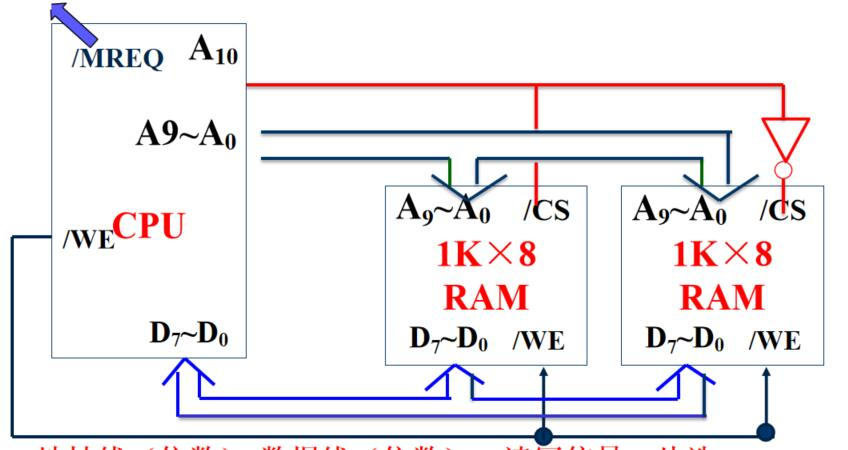
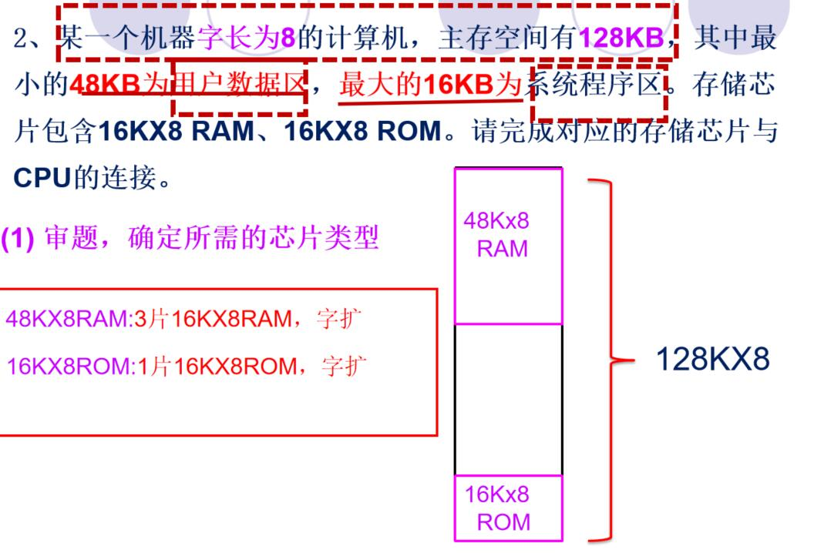

# 第一章 数字逻辑基本知识

**数值的转换**

- 十进制整数——二进制（除二取余）
- 十进制小数——二进制（乘二取整）
- 十六进制——二进制（1位十六进制转换成4位二进制）


同或：A⊙B


- 与门：有0出0，全1出1
- 或门：有1出1，全0出0
- 非门：逻辑反
- 与非门：有0出1，全1出0
- 或非门：有1出0，全0出1
- 异或门：不同出1，相同出0


**化简公式**

基本公式

```txt
0 · A = 0 , 1 · A = 1 , A · A = A ， A · A(非) = 0
0 + A = 0 , 1 + A = 1 , A + A = A ， A + A(非) = 1 ， [A(非)](非)=A
```

交换律

```txt
AB=BA
A+B=B+A
```

结合律

```txt
ABC=(AB)C=A(BC)
A+B+C=A+(B+C)=(A+B)+C
```

分配律

```txt
A(B+C)=AB+AC
A+BC=(A+B)(A+C)
```

吸收律

```txt
A(A+B)=A,A[A(非)+B]=AB,A+AB=A,A+A(非)B=A+B，AB+A(非)B=A
(A+B)[A+B(非)]=A
```

反演律

```txt
(AB)(非)=A(非)+B(非)
(A+B)(非)=A(非)B(非)
```

**重点：**


# 第二章 运算方法与运算器


## 数据格式

### 浮点数

浮点数的一般表示形式：


**例子：**


### IEEE754标准


- 数符 S：表示浮点数的符号，占1位，0—正数、1—负数
- 尾数M：23位，原码纯小数表示，小数点在尾数域的最前面
  - **由于原码表示的规格化浮点数要求，最高数值位始终为1，因此该标准中隐藏最高数值位(1)，尾数的实际值为1.M；**

- 阶码E：8 位，采用有偏移值的移码表示
  - **E=e+127，其中e是指数真值**
- **浮点数真值：N=（-1）S×（1.M）×2E-127**


例子：

1. 将(20.59375)10转换成754标准的32位浮点数的**二进制存储格式**。

> **解:**
>
> ​	(20.59375)<sub>10</sub> = (10100.10011)<sub>2</sub>
>
> ​			20  = (10100)<sub>2</sub>     0.59375 = (0.10011)<sub>2</sub> （可不写）
>
> **将尾数规范为1.M的形式：**
>
> ​	10100.10011 = 1.010010011 X2<sup>4</sup>  **e = 4**
>
> **可得：**
>
> ​	M = 010010011;
>
> ​	S = 0;
>
> ​	E = e + 127 = 4 + 127 = 131 = (1000 0011)<sub>2</sub>
>
> **故，32位浮点数的754标准格式为：**
>
> ​	(**0**100 0001 1**010 0100 1100 0000 0000 0000**)<sub>2</sub> = (41A4C000)<sub>16</sub>

2. 若浮点数ｘ的754标准存储格式为(41360000)16，求其浮点数的**十进制数值**。

> (41360000)<sub>16</sub> = (0100 0001 0011 0110 0000 0000 0000)<sub>2</sub>
>
> ​	S = 0
>
> ​	E = 1000 0010 = 130
>
> ​	e = E - 127 = 130 - 127 = 3
>
> ​	M = 0110 11
>
> 尾数1.M = 1.011011
>
> **浮点数N** = (-1)<sup>S</sup> ×(1.M)×2<sup>e</sup>
>
> ​			    = (-1)<sup>0</sup>× 1.011011 × 2<sup>3</sup>
>
> ​				= (1011.011)<sup>2</sup> = (11.375)<sub>2</sub>

3. 请给出十进制数-0.8125表示成IEEE754格式的32位浮点数的二进制以及16进制存储形式

> -0.8125 = (-0.1101)<sub>2</sub>
>
> 0.8125 × 2 = 1.625 ------ 1
>
> 0.625   × 2 = 1.25 -------- 1
>
> 0.25     × 2 = 0.5 ---------- 0
>
> 0.5       × 2 = 1.0 ---------- 1
>
> 
>
> 将尾数规范为1.M的形式：
>
> 1.M= -1.101 × 2<sup>-1</sup>
>
> 可得：
>
> S = 1
>
> M = 101
>
> E = e +127 = (-1) + 127 = 126 = (0111 1110)<sub>2</sub>
>
> 32位浮点数的754标准格式为:
>
> （**1**011 1111 0**101 0000 0000 0000 0000 0000**)<sub>2</sub> = (BF500000)<sub>16</sub>

4. 若浮点数的16进制32位IEEE754存储形式为0x40280000，求其十进制值?

>(40280000)<sub>16</sub> = (0100 0000 0010 1000 0000 0000 0000 0000)<sub>2</sub>
>
>由其可得:
>
>S = 0
>
>E = 1000 0000
>
>e = E - 127 = 128-127 = 1
>
>1.M = 1.0101
>
>浮点数真值N = (-1)<sup>S</sup> × 1.M × 2<sup>e</sup>
>
>​					= (-1)<sup>0</sup> ×1.0101 × 2<sup>1</sup>
>
>​					= (10.101)<sub>2</sub> = (2.675)<sub>10</sub>

## 定点加、减、乘运算

### 补码加、减法

- 补码加法规则
  - 两个相加的数无论正负，其和的补码等于两数补码之和
                 [X+Y]补=[X]补+[Y]补

>ｘ＝+1001, ｙ＝+0101，求ｘ＋ｙ。
>
>​		[ｘ]补＝0 1001, [ｙ]补＝0 0101
>​                  [ｘ]补　   0 1001
>​              ＋[ｙ]补　   0 0101
>
>---
>
>​		   [ｘ＋ｙ]补　   0 1110　 
>
>所以　ｘ＋ｙ＝＋1110 

> x＝＋1011, ｙ＝**－0101**,求ｘ＋ｙ
>
> [ｘ]补＝0 1011, [ｙ]补＝1 1011 
>         [ｘ]补　　　0 1011
>     ＋[ｙ]补　　　1 1011
>   [ｘ＋ｙ]补        10 0110　 
>
> ---
>
> 所以　ｘ＋ｙ＝+ 0110 

- 如果当前系统只提供了求补器和加法器，那么可以将**[x]补+[-y]补=[x+(-y)]补=[x-y]补**

- 补码减法规则
  - 两个相减的数无论正负：[X－Y]补= [X+(-Y)]补＝[X]补+[-Y]补
  - [-Y]补为[Y]补的机器负数,转换方法:将连同符号位一起变反,末位加1。
  - 若指令操作码为加，则两数直接相加；若操作码为减**，则将减数连同符号位一起变反加1**后再与被减数相加。

### 溢出

#### 溢出概念

- 溢出
  - 在定点数机器中，数的大小超出了定点数能表示的范围
- 上溢
  - 数据大于机器所能表示的最大正数
- 下溢
  - 数据小于机器所能表示的最小负数

#### 判别方法---变形补码判别法

- 变形补码，也叫模4补码：采用**双符号位**表示补码
- 正数：两个符号位都是0
  - 00 Xn-1Xn-2……X1X0
- 负数：两个符号位都是1
  - 11 Xn-1Xn-2……X1X0

**判别方法**

| 双符号位 | 结果 |
| -------- | ---- |
| 00       | 正   |
| 01       | 上溢 |
| 10       | 下溢 |
| 11       | 负   |

例子：

- 若[x]补=00101，[y]补=00100，则[x+y]补=**01** 001  上溢
- 若[x]补=11011，[y]补=11100，则[x+y]补=**10** 111  下溢
- 若[x]补=00101，[y]补=11100 ，则[x-y]补=**01** 001  上溢

1. 设机器数字长**为8位（含2位符号位）**，已知A= 15/32，B=-19/32，用变形补码运算规则分别计算A+B和A-B的值，并且分别判断是否溢出。

> $$
> A = \frac{15}{32} = 1111 × 2^-5 = 0.01111
> $$
>
> $$
> B = -\frac{19}{32} = -10011 × 2 ^-5 = -0.10011
> $$
>
> [A]<sub>补</sub> = **00**.011110
>
> [B]<sub>补</sub> = **11**.011010
>
> [-B]<sub>补</sub> = **00**.100110
>
> ​							[A]<sub>补</sub> + [B]<sub>补</sub> = 00.011110 + 11.011010
>
> ​									00.011110
>
> ​								+  11.011010
>
> ---
>
> ​									**11**.111000
>
> ​									**无溢出**
>
> ​								**A+B = -0.001**
>
> 
>
> ​							[A]<sub>补</sub> - [B]<sub>补</sub> =  [A]<sub>补</sub> + [-B]<sub>补</sub> = 00.011110 + 00.100110
>
> ​									00.011110
>
> ​								+  00.100110
>
> ---
>
> ​									01.000100
>
> ​									下溢

2. 设机器数字长为**8位（含2位符号位）**，已知A=14，B=-20，用变形补码运算规则分别计算A+B和A-B的值，并且分别判断是否溢出。

> ​							A = 14  = + 001110
>
> ​							B = -20 = - 010100
>
> [A]<sub>补</sub> = **00** 001110
>
> [B]<sub>补</sub> = **11 **101100
>
> [-B]<sub>补</sub>= **00** 010100
>
> ​							[A]<sub>补</sub> + [B]<sub>补</sub> = 00 001110 + 11 101100
>
> ​											00 001110
>
> ​									+	  11 101100
>
> ---
>
> ​											11  111010
>
> ​											**无溢出**
>
> ​							A+B = (- 000110)<sub>2</sub> = -6
>
> 
>
> ​							[A]<sub>补</sub> - [B]<sub>补</sub> =  [A]<sub>补</sub> + [-B]<sub>补</sub> = 00 001110 + 00 010100
>
> ​										00 001110
>
> ​								+	  00 010100
>
> ---
>
> ​										00 100010
>
> ​										**无溢出**
>
> ​							A -B = (+100010)<sub>2</sub> = +34


### 定点乘法运算

- 符号与数值分开计算
  - 乘积的数值部分是两个正数相乘之积
  - 乘积符号的运算法则是：同号相乘为正,异号相乘为负可由**异或**实现


例：已知 X = 0.1101， Y = - 0.1011 求X×Y的值

> ​								0.1 1 0 1
> ​							×  0.1 0 1 1
>
> ---
>
> ​								   1 1 0 1
>
> ​								1 1 0 1
>
> ​							 0 0 0 0
>
> ​						  1 1 0 1
>
> ---
>
> ​				 0.1 0 0 0 1 1 1 1
>
>
> ​			X *Y = -0.10001111


**求补器求补码列阵乘法器求乘积步骤：**

1. 输入数据用补码表示
2. 单独计算最终符号
3. 计算算前求补器输出
4. 进行不带符号的原码乘法
5. 将计算结果结合最终符号位，得到算后求补输出
6. 将算后求补输出结合符号为转换为真值

**解题步骤：**

① 将A和B转为二进制，并写出它们的补码形式
    [A]补＝符号+数值     [B]补＝符号+数值

②符号位单独考虑：两个符号进行异或（不同为1，相同为0）

③算前求补输出：|x|=                |y|= 

④阵列乘法输出： |x|× |y|=

⑤结合②得到的符号位，求算后求补输出 （正数/负数的补码）

⑥将②和⑤组合 得到乘积[x × y]补=


**例子：**

1.设ｘ＝－23,ｙ＝20,用带求补器的补码阵列乘法器求出乘积ｘ*ｙ＝？（求10进制真值）

> ① x = -10111      ，  y = 10100
>
> ​	[x]<sub>补</sub> = 1  01001，[y]<sub>补</sub> = 0  10100
>
> ② 1 ⊕  0 = 1
>
> ③ |x| = 10111，|y| = 10100
>
> ④ |x|×|y| =  10111 × 10100 = 1 1100 1100
>
> ​					1 0 1 1 1
>
> ​		       x   1 0 1 0 0
>
> ----
>
> ​				    0 0 0 0 0
>
> ​				 0 0 0 0 0
>
> ​	    	  1 0 1 1 1
>
> ​	 	  0 0 0 0 0 
>
> ​		1 0 1 1 1
>
> ---
>
> ​        1 1 1 0 0 1 1 0 0
>
> ⑤符号位为1，得到：0 0011 0100
>
> ⑥[x × y]<sub>补</sub> = 1 000110100 
>
> 真值 = (-460)<sub>10</sub>

2. 设ｘ＝－0.1101,ｙ＝-0.1001,用带求补器的补码阵列乘法器求出乘积ｘ*ｙ＝？

> ①[x]<sub>补</sub> = 1.0011，[y]<sub>补</sub> = 1.0111
>
> ②1 ⊕ 1 = 0
>
> ③ |x| = 0.1101，|y| = 0.1001
>
> ④ |x|×|y| =  0.1101 × 0.1001 =  0.0111 0101
>
> ​								0.1 1 0 1
>
> ​						×	  0.1 0 0 1
>
> ---
>
> ​								   1 1 0 1			
>
> ​								0 0 0 0
>
> ​							 0 0 0 0
>
> ​						  1 1 0 1
>
> ---
>
> ​				    0.0 1 1 1 0 1 0 1
>
> ⑤符号位为0，得到 0.0111 0101
>
> ⑥[x × y]<sub>补</sub> = 0.0111 0101


# 第三章 存储器


## 存储器概述

存储器的作用：存放**指令与数据**

**存储器是由许多存储单元组成的，每一个单元有一个编号，这个编号称为存储单元的地址，一般用二进制或十六进制数表示，每一个存储单元的地址是唯一的。**


|          | SRAM       | DRAM     |
| -------- | ---------- | -------- |
| 电路     | 双稳触发器 | 栅极电容 |
| 访问速度 | 快         | 慢       |
| 集成度   | 低         | 高       |
| 功耗     | 高         | 低       |
| 价格     | 高         | 低       |

- SRAM主要用于构成Cache
- DRAM主要用于构成主存

### 概念

- 存储元：用于保存一位0/1二进制数据的物理器件
- 存储单元：由若干个存储元组成；**（字长）** 每个存储单元占用1个地址。（字地址或字节地址）
- 存储器：由许多存储单元组成
- 存储容量：指一个存储器中可以容纳的存储单元总数，以字节B为单位：KB、MB、GB、TB
  - 1KB = 2<sup>10</sup>B
  - 1MB = 2<sup>20</sup>B
  - 1GB = 2<sup>30B</sup>
  - 1TB = 2<sup>40</sup>B


>存储器的外部管脚有三组线，分别是**地址线(AB)**：数目与存储单元的个数成2M次方
>
>​															  **数据线(DB)**：与存储单元的位数即存储字长相等
>
>​														 	 **控制线(CB)**：片选信号、读写控制信号

例子：

- 某机存储容量为128M×16，则该系统所需的地址线为 **27**根，数据线位数为 **16** 根。
- 某机存储容量为 512K×8，则该系统所需的地址线为 **19** 根，数据线位数为  **8**  根。
- 某机存储容量为 8K×32，则该系统所需的地址线为  **13**   根，数据线位数为  **32**   根。


### 存储器分类

- 按存储内容可变性分

  - 只读存储器(ROM)
  - 随机读写存储器(RAM)

  ROM与RAM都是半导体存储器

- 按信息易失性分

  - 易失性存储器
  - 非易失性存储器

- 按在计算机系统中的作用分

  - 主存储器
  - 辅助存储器
  - 高速缓冲存储器(Cache)
  - 控制存储器

> 内存包含：任何能被CPU直接访问的都是内存，如：主存储器、随机存储器（RAM）、高速缓冲存储器（Cache）、随机读写存储器(RAM)等。

#### 分级结构


- 三级存储系统结构


​								缓存<----->主存                                                                           主存<---->辅存

- 缓存<----->主存层次
  1. 加上cache的目的为提高速度
  2. 内存包括cache和主存
- ​    主存<---->辅存
  1. 降低了成本，扩大了容量
  2. 虚存系统包括主存和辅存


- 主存：存放系统当前运行需要的所有程序和数据，我们经常的讲的存储器属于一般认为就是主存
- 缓存：Cache，为了提高CPU访问主存的速度
- 辅存：为了提高CPU访问主存的容量


**题目：**

>1. 储器是计算机系统中的记忆设备，它主要用来
>
>   ​	A．存放数据          B．存放程序
>   ​    C．**存放数据和程序**    D．存放微程序
>
>2. 存储单元是指 
>
>   A.存放一个二进制信息位的存储元    B．**存放一个机器字的所有存储元集合**
>   C.存放一个字节的所有存储元集合    D．存放两个字节的所有存储元集合
>
>3. 计算机的存储器采用分级存储体系的主要目的是
>
>   ​	A.便于读写数据    B.减小机箱的体积
>   　C.便于系统升级    D.**解决存储容量、价格和存取速度之间的矛盾**
>
>4. 某SRAM芯片，其存储容量为64K × 16位，该芯片的地址线和数据线数目为
>
>   ​	A．64，16    B．16，64    
>   ​    C．64，8     D．**16，16**


## SRAM存储器

- 片选端CS* 或CE*
  
- 有效时，可以对该芯片进行读写操作
  
- 输出OE*

  - 控制读操作。有效时，芯片内数据输出
  - 该控制端对应系统的读控制线

- 写WE*

  - 控制写操作。有效时，数据进入芯片中
  - 该控制端对应系统的写控制线

- 地址线

  - 2n个单元，对应有n根地址线

- 数据线

  - 每个单元m位，对应有m根数据线

- 控制线

  - $$
    读写控制信号R/\overline{\text{W}}
    $$

  - $$
    R/\overline{\text{W}} = 1，为读操作；R/\overline{\text{W}} = 0,为写操作
    $$

    


> 
>
> 1. 图上你可以获取哪些目前你关于存储器的认识？
>
> ````txt
> 这是一个SRAM，有一个存储体，是一个存储系统。一个地址译码器来接收地址总线上的数据，对地址进行运算，找到需要读或写的地址。一个译码输出驱动器，用来选择译码输出后的地址，一个片选与读写控制单元，用来控制是进行读操作还是进行写操作。一个输出驱动，用来输出数据。
> 三组信号线：数据总线6根（A5~A0）、数据总线4根（I/O3~I/O0）、控制总线1根。
> 6根地址总线，有2^6=64个存储单元，4位的数据线，所以每个存储单元有4个存储元，每个存储元中都有一个静态存储元阵列（1位锁存器），一共有64X4=256个静态存储元阵列。
> ````
>
> 2. 在SRAM里面，怎么进行数据的写操作或读操作，建议举个具体例子
>
> ````txt
> ①指定某个存储单元。②准备好指定的数据。③CPU发出读或写操作指令。比如在本图中在05H的地址存储(+2)的时候，如下步骤：
> ①找存储单元，地址线发出存储在000101(A5~A0顺序)地址，通过地址译码器找到选择线5连接的存储单元地址。
> ②准备好数据已补码形式转换为0010（I/O3~I/O0）放入数据输入缓冲驱动中。
> ③CPU通过控制线发出写操作命令也就是发送0，将输出驱动的数据存储到000101(A5~A0顺序)地址里，地址的存储单元数据变成0010（I/O3~I/O0）。
> ````


## DRAM存储器

- 动态RAM（DRAM）
- DRAM的存储元

### 存储器扩充

- 字扩充


- 位扩充


- 字位扩充


> 1. 设CPU有10根地址线，8根数据线，有一个1K×8bit的RAM芯片，请画出逻辑连线图
>
> 
>
> 2. 位扩充：设CPU有12根地址线，16根数据线，有4个4K×4bit的RAM芯片，请画出逻辑连线图
>
> 
>
> 3. 字扩充：由1K×8的存储芯片构成2K×8的存储器(2位)
>
> 
>
> 1. 字扩充：  用2M×8的SRAM芯片构成一个8M×8的存储器。（2-4译码器）
>
> 
>
> 5. 完成2MX8  扩充为16MX8的存储器与CPU的连接图(3-8译码器)
>
> 
>
> 6. 
> 7. 某一个机器字长为8的计算机，主存空间有128KB，其中**最小的48KB为用户数据区**，最大的**16KB为系统程序区**。存储芯片包含16KX8 RAM、16KX8 ROM。请完成对应的存储芯片与CPU的连接。
>
> 
>
> 8. 
>
> 8.  
>
> (4)请完成图中CPU与存储芯片的连接（请根据分析，按需要先画出CPU以及存储芯片的管脚）。若有需要自行增加
>
> 

**CPU到存储器的读写**

现有一个操作数（1011 0001），怎样将它存起来？

1. 指定某个存储单元401H（100 0000 0001）
2. 准备好指定数据（1011 0001）
3. CPU发出写操作命令:/MREQ=0，/WE=0(写）


## Cache存储器

Cache是SRAM,它的基本原理：

- 插入到CPU与主存间
- 由快速SRAM实现
- 存储主存的部分
  - 指令
  - 数据
- 操作
  - 命中(在Cache中)
  - 不命中(不在Cache中)

根据**访存局部性原理**，可以在主存和CPU之间设置一个高速的容量相对较小的存储器，如果当前正在执行的程序和数据存放在这个存储器中，在程序运行时，不必从主存储器取指令和取数据，只需访问这个高速存储器，以提高程序运行速度。这个存储器称作高速缓冲存储器Cache。

### Cahche常用公式

- **Cache命中率**：

$$
命中率=\dfrac{访问信息在Cache中的次数}{总次数}×100\%
$$

$$
失效率 = 1 - 命中率
$$

- **Cache/主存系统的平均访问时间t<sub>a</sub>为**
  - t<sub>c</sub>------------命中时的cache访问时间
  - t<sub>m</sub>-----------未命中时的主存访问时间
  - h------------命中率


$$
t_a = ht_c+(1-h)t_m
$$

- **设r = t<sub>m</sub>/t<sub>c</sub>，则系统的访问效率e为**

$$
e =\dfrac{t_c}{t_a} =\dfrac{t_c}{ht_c+(1-h)t_m} = \dfrac{1}{h+(1+h)r} = \dfrac{1}{r+(1+r)h}
$$

> 1. CPU执行一段程序时，cache完成存取的次数为1900次，主存完成存取的次数为100次，已知cache存取周期为50ns，主存存取周期为250ns，求**cache/主存系统的效率**和平均访问时间。
>
> $$
> 命中率=\dfrac{访问信息在Cache中的次数}{总次数}×100\% = \dfrac{N_c}{NC_c+N_m}×100\%
> $$
>
> $$
> h = \dfrac{1900}{1900+100}×100\% = 95\%
> $$
>
> ​								
> $$
> t_c = 50ns，t_m = 250ns
> $$
> **Cache/主存系统的平均访问时间:**
> $$
> t_a = ht_c+(1-h)t_m
> $$
> ​				
> $$
> ta = 0.95×50+(1-0.95)×250 = 60ns
> $$
> **平均访问时间:**
> $$
> e = \dfrac{tc}{ta} = \dfrac{50}{60}×100\% ≈83.3\%
> $$

> 2. 某计算机系统的内存由Cache和主存构成。假设CPU执行一段程序时，CPU共访问内存4800次（内存包含Cache跟主存，即Nc+Nm=4800)，其中访问主存600次(Nm=600)；Cache的存取周期为45ns(tc=45ns），主存的存取周期为200ns（tm=200ns)，求：
>    （1）Cache的命中率是多少？
>    $$
>    命中率h = \dfrac{N_c}{Nm} = \dfrac{4800-600}{4800}×100\% = 87.5\%
>    $$
>    （2）CPU访问内存的平均访问时间是多少？
>
>    t<sub>c</sub> = 45ns
>
>    t<sub>m</sub> = 200ns
>    $$
>    t_a = ht_c+(1-h)t_m = 0.875×45+0.125×200 = 39.375+25 = 64.375ns
>    $$
>    （3）Cache/主存系统的效率是多少？
>    $$
>    e = \dfrac{tc}{ta} = \dfrac{45}{64.375}×100\% ≈69.9\%
>    $$

### Cache结构模块化

- CPU访问cache或主存时，以字为单位；

- Cache和主存交换信息时，以块为单位，一次读入一块或多块内容

  - 每块由若干个字组成

- 在高速缓冲存储器中,把Cache和主存机械等分为**相同大小的块**,每一块是由**若干个字(或字节)组成**

  - 某机主存容量为1MB,划分为2048块,每块512B;Cache容量为8KB,划分为16块,每块512B

- 由于Cache的块数远小于主存的块数，因此一个Cache不能唯一地、永久地只对应一个贮存块，**在Cache中，每一行外加有一个标记，指明它是主存的哪一块的副本(拷贝)**

- 模块化后，主存地址和Cache地址可进一步细分

  

  - 主存块号（S位）：指出某个存储单元在主存的哪一个块
  - 块内地址（W位）：指出在块内的哪一个单元

  

  - Cache行号（r位）：指出某个存储单元在主存的哪一个块
  - 行内地址（W位）：指出在块内的哪一个单元

> 1. 主存有1MB，主存块尺寸为512字节，Cache尺寸为128KB。请问
>
> （1）主存有多少块？	1M÷512 = 2048块
> （2）Cache有多少行？128K÷512=256行
> （3）04008H单元的数据在主存的哪一块？
> $$
> n=\underbrace{0000\quad0100\quad000}_{块号}\quad\overbrace{0\quad0000\quad1000}^{块内地址}
> $$
>


## 主存与Cache的地址映射

- 地址映射：其物理意义就是位置的对应关系，**将主存地址变成Cache地址**。

- 常见的映射方式主要有三种
  - 全相联映射方式
  - 直接映射方式
  - 组相联映射方式


### 全相联映射方式

- 全相联映射方式：主存中的每一个块映射到cache中的任何一个行中。需在cache的一行中增加标记部分，存放该行内容的主存块的块号。
- 相联存储器的容量：2<sup>r</sup>×s (bit)

> 设主存容量1MB，cache容量16KB，块的大小为512B，采用全相联映射方式。
>
> cache容量 = 16KB = 2<sup>14</sup>B
>
> 主存容量 = 1MB = 2<sup>20</sup>B
>
> 块大小 = 512B = 2<sup>9</sup>
>
> 1. 写出cache的地址格式。
>
>    14-9 = 5
>
>    
>
> 2. 写出主存的地址格式。
>
>    20 - 9 = 11
>
>    
>
> 3. 块表的容量多大？
>
>    块表的大小应为2<sup>r</sup>×s位，即2<sup>5</sup>×11位
>
> 4. 主存地址为CDE8FH的单元，在cache中的什么位置？
>    $$
>    n=\underbrace{1100\quad1101\quad111}\quad\overbrace{0\quad1000\quad1111}^{块内地址}B
>    $$
>    ∴其块内地址为0 1000 1111B

### 直接地址映射

- 一个主存块只能复制到cache的一个特定行中。如设cache中有m行，则主存的第0块，第m块，第2m块，…,第2S-m块只能映射到cache的第0行，主存的第1块，第m+1块，第2m+1块，…,第2S-m+1块只能映射到cache的第1行。
- 相联存储器的容量：2<sup>r</sup>×(s - r) (bit)

> 设主存容量1MB，cache容量16KB，块的大小为512B，采用直接映射方式
>
> 主存容量 = 1MB = 2<sup>20</sup>B
>
> cache容量 = 16KB = 2<sup>14</sup>B
>
> 块大小 = 512B = 2<sup>9</sup>B
>
> 1. 块表的容量多大？
>
>    块表的大小应为2<sup>r</sup>×s-r位，即2<sup>5</sup>×6位
>
> 2. 画出地址映射及变换示意图。
>
>    
>
> 3. 主存地址为CDE8FH的单元在cache中的什么位置？
>
>    CDE8FH = **1100 11**01 111**0 1000 1111**
>
>    对应与Cache的第01111行，行内地址01 1000 11111
>
>    

### 组相联地址映射

- 将Cache中的行等分为若干组，主存中的每一块只能映射到Cache的特定组中，但是可调入到该组的任一行中；
- 间为直接映射，组内为全相联映射
- 当Cache的一组包含r行时，通常称为r路组相联映射
- 相联存储器的容量：2<sup>r</sup>×(ｓ- d)   (bit)

> 假设内存有64KB(按字节寻址)，一个cache行是64字节。cache是4路组相联，总共有16KB。请问主存地址3F97H将映射到哪第一个cache组
>
> Cache的行和主存的块尺寸相同，因此推算cache的组数：**64组**，因此组好需要占用**6**位。
>
> Cache的一个块的尺寸是64B，因此Cache的块内地址有**8**位。
>
> 3F97H的二进制形式是：**0011** 1111 10**01 0111** B,块内地址**01 0111**,其中组号是**1111 10**。


> 1. 某系统的存储器为2MB，每字块为8个字，每字32位，若cache为16KB，采用字节编址方式。问： 
>
>    主存 = 2MB = 2<sup>21</sup>B
>
>    字块=8B = 2<sup>3</sup>B
>
>    cache = 16KB = 2<sup>14</sup>B
>
>      （1）采用全相联映射，主存地址格式是什么？
>
>    21 - 3 = 18
>
>    
>
>     （2）采用直接映射，主存地址格式是什么？
>
>    21 - 14 = 7
>
>    
>
>    （3）采用16路组相联映射，主存地址格式是什么？
>
>    16 = 2<sup>4</sup>
>
>    14 - 4 - 3 = 7
>
>    
>
> 2. 某机主存容量为128MB，Cache容量为64KB，Cache和主存同时分块，每个块的大小为512B，采用字节编址。问：
>
>    主存 = 128MB = 2<sup>27</sup>B
>
>    Cache = 64KB = 2<sup>16</sup>B
>
>    块大小 = 512B = 2<sup>9</sup>B
>
>    （1）主存共有多少个块，块内地址占多少位？
>
>    2<sup>27</sup>B ÷2<sup>9</sup>B = 2<sup>18</sup> = 256K（块）；块内地址占9位。
>
>    （2）采用全相联映射方式，主存地址格式是什么？Cache地址格式是什么？
>
>    主存：
>
>    
>
>    Cache:
>
>    
>
>    （3）采用直接映射方式，主存地址格式是什么？Cache地址格式是什么？
>
>    主存：
>
>    
>
>    cache:
>
>    
>
>    （4）直接映射方式下，如何根据CPU提供的某个主存地址到Cache中获取相应数据。
>
>    ①将CPU给出的主存地址前11位直接与所定位行的标记做一次比较；
>
>    ②若已判断出数据在cache里，则直接根据w位的块内地址到cache中定位；
>
>    ③若未命中，则按照内存地址访问，同时读入到cache行中。
>
>    （5）采用16路组相联映射方式，主存地址格式是什么？Cache地址格式？
>
>    主存：
>
>    
>
>    cache：
>
>     


# 第四章 指令系统


## 指令格式


- 指令一般分为**操作码与地址码**。

- 操作码

  - 指令必须有操作码字段。

  - 作用：用于指明操作的类型；

- 地址码

  - 一条指令格式中有几个地址码字段，就称为是几地址指令

  - 作用：用于指明操作数的地址
  - 分为
    1. 四地址指令
    2. 三地址指令
    3. 二地址指令：OP
    4. 一地址指令:OP
    5. 零地址指令 ：NOP、HALT


## 寻址方式

| 非访存寻址方式 | 访存寻址方式      | 控制转移寻址方式 |
| -------------- | ----------------- | ---------------- |
| (1)立即寻址    | (4)直接寻址       | (9)相对寻址      |
| (2)寄存器寻址  | (5)间接寻址       |                  |
| (3)隐含寻址    | (6)寄存器间接寻址 |                  |
|                | (7)基址寻址       |                  |
|                | (8)变址寻址       |                  |

- 立即寻址：操作数直接存放在指令中
- 寄存器寻址：操作数存放在寄存器中，指令中给出寄存器号
- 隐含寻址：指令中不给出操作数寻址，操作数隐含在某个特殊寄存器中，如累加器ACC
- 直接寻址：指令中直接给出操作数的有效地址
- 间接寻址：指令中给出**存放操作数地址**的存储单元的有效地址
- 寄存器间接寻址：指令中给出存放操作数有效地址的寄存器的编号
- 偏移寻址：直接寻址和寄存器间接寻址方式的结合
- 相对寻址：有效地址，相对于当前程序计数器PC的内容，加上偏移量

> 1. 指令的编码将指令分成**操作码** 、**地址码**等字段。
> 2. 指令编码中，操作码用来指定 **操作类型**，n位操作码最多可以表示2<sup>n</sup> 条指令。
> 3. 寄存器间接寻址方式中，给出的是**操作数地址**所在的寄存器号.
> 4. 根据操作数所在位置，指出其寻址方式：操作数在寄存器中，为(**寄存器**)寻址方式；操作数地址在寄存器中称为(**寄存器间接**)寻址方式；操作数在指令中，称为(**立即**)寻址方式；操作数地址(主存)在指令中，为(**直接**)寻址方式。操作数的地址
> 5. 变址寻址方式中，操作数的有效地址等于（**基址寄存器内容加上形式地址（位移量）**）
> 6. 先计算后再访问内存的寻址方式是**变址寻址**
> 7. 操作数地址存放在寄存器的寻址方式叫**寄存器间接寻址**。


# 第五章 CPU中央处理器

## CPU的功能

程序首先被存放在辅助存储器中，运行时，由操作系统把程序装入主存，并将程序第一条指令在内存中的地址，送PC；CPU按照PC中的指令地址，**自动完成取出指令**和**执行指令**的任务。

- 主要功能
  - 指令控制：控制程序的执行顺序
    - 顺序寻址
    - 跳跃寻址
  - 操作控制：对指令操作码译码后产生控制信号
    - 产生和发送各操作信号
  - 时间控制：维持各类操作的时序关系
    - 控制指令、或操作的实施时间
  - 数据加工：由ALU完成具体的运算
    - 对数据进行算术逻辑运算
- CPU的组成
  - 算术逻辑运算单元：负责完成数据的算术、逻辑运算
  - 寄存器组：用来存放取出的指令和数据等信息
  - 控制单元：用来产生各种控制信号
  - 中断系统：用来处理异常情况和特殊请求
- CPU寄存器
  - PC：（Program Counter，PC）程序计数器，通常被称为指令计数器，存放下一条要执行的指令在内存中的地址，大多数执行是按顺序执行的，所以修改的过程通常只是简单地对PC加1。当程序转移时，转移指令执行的最终结果就是要改变PC的值，此PC值就是地址，以此实现转移
  - IR：（Instruction Register，IR）用来存放当前正在执行的指令。当执行一条指令时，首先把该指令从主存读取到数据寄存器中，然后再传送至指令寄存器。
  - DR：（Data Register，DR）数据寄存器又称为数据缓冲寄存器，用来存放将要存入存储器中的数据，或是从存储器读出的数据。作为CPU和主存、外设之间信息传输的中转站，用以弥补CPU和主存、外设之间操作速度上的差异。
  - AR：（Address Register，AR）用来保存当前CPU所要访问的内存单元或I/O设备的地址。由于内存与CPU之间存在速度上的差距，需使用地址寄存器来保存地址信息，直到内存读或取操作完成为止。
  - 通用寄存器：（Accumulator，AC）又称为累加寄存器，用来存放运算结果和取出的操作数。
    累加器的功能是：当运算器的算术逻辑单元ALU执行算术或逻辑运算时，为ALU提供一个工作区，可以为ALU暂时保存一个操作数或运算结果。
  - PSW：（Program Status Word，PSW）程序状态字寄存器，用来存放一些状态标志位的。如运算结果进/借位标志（C）、运算结果溢出标志（V）、运算结果为零标志（Z）、运算结果为负标志（N）、运算结果符号标志（S）。